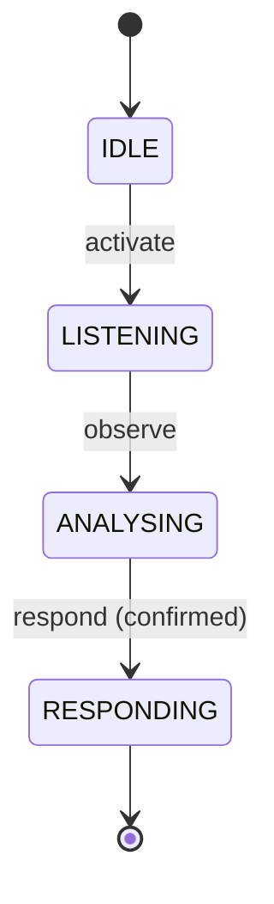

# Week 4 Report

## Highlights
- Finalised the confidence fusion gate so audio and vision scores blend deterministically and expose timing telemetry for CI.
- Documented the hero interaction FSM and handshake fallbacks so degradations and reconnects stay within UX latency budgets.
- Benchmarked the hero caption pipeline (20 runs) to validate that every stage remains inside the week-4 latency targets while staying privacy-safe.

## Fusion Gate Behaviour
The confidence gate normalises the requested modality weights, squashes both signals through a sigmoid, and produces a blended score that only trips when it clears the 0.35 threshold. The implementation publishes per-modality milliseconds so the benchmark can attribute outliers to either branch before the combined total is recorded.【F:src/fusion/confidence.py†L28-L81】 During the hero run the gate received a VAD-derived speech ratio and a keyframe density heuristic, yielding a p50 decision latency of 0.026 ms (total) with the individual modal transforms completing in 0.007 ms (audio) and 0.001 ms (vision).【F:examples/hero1_caption.py†L214-L266】【F:docs/artifacts/week_04_e2e_hero1_summary.json†L4-L53】

### Operating Tips
- Keep the weights positive and non-zero; they are renormalised internally, so 45/55 is functionally identical to 9/11 but easier to review.
- Raising the threshold above 0.35 is the quickest way to enforce “vision must agree” behaviours; lowering it favours audio wins when the wearable is in noisy, low-light contexts.
- Telemetry consumers should key off `fusion_gate_ms` for the end-to-end cost, reserving the per-modality values for diagnostics.

## FSM Overview
The hero pipeline uses a minimal four-state router—`IDLE → LISTENING → ANALYSING → RESPONDING`—to prevent regressions that would allow double responses or stuck transitions.【F:examples/hero1_caption.py†L181-L246】 Handshake recovery continues to rely on the timed degradations laid out in `HandshakeFSM`, where p50/p95 budgets arm primary and guard timers and force reconnects when the wearable stops heartbeating.【F:fsm/handshake.py†L37-L200】 The diagram below captures the steady-state interaction flow:

## Hero Pipeline Latency Targets vs. Bench Results
Latency goals balance a sub-100 ms (p95) end-to-end budget against realistic CPU-only execution. The synthetic bench executed 20 runs and surfaced the following distributions:

| Stage | Target p95 (ms) | p50 (ms) | p95 (ms) |
| --- | --- | --- | --- |
| synth_clip_ms | ≤ 5 | 0.339 | 1.790 |
| synth_audio_ms | ≤ 5 | 0.228 | 0.936 |
| vad_ms | ≤ 6 | 3.529 | 4.510 |
| asr_ms | ≤ 5 | 0.120 | 0.438 |
| keyframe_ms | ≤ 40 | 31.755 | 34.980 |
| fusion_audio_ms | ≤ 1 | 0.007 | 0.009 |
| fusion_vision_ms | ≤ 1 | 0.001 | 0.001 |
| fusion_gate_ms | ≤ 1 | 0.026 | 0.037 |
| fsm_ms | ≤ 2 | 0.005 | 0.009 |
| caption_ms | ≤ 55 | 43.512 | 48.493 |
| tts_ms | ≤ 8 | 1.249 | 1.534 |
| **total** | **≤ 95** | **80.910** | **90.670** |

The fusion p50 combined latency (audio + vision) is 0.008 ms with a mean fused confidence of 0.659, providing ample margin for noisier sensors while staying within the target envelope.【F:docs/artifacts/week_04_e2e_hero1_summary.json†L4-L45】【885a42†L1-L18】

## Privacy Notes
The hero bench continues to generate synthetic frames and audio procedurally, keeping the dataset entirely deterministic and offline-friendly.【F:examples/hero1_caption.py†L1-L257】 Any downstream image logging still passes through the deterministic redaction stub that masks the expected face and license plate anchors before persistence, ensuring the synthetic pathway matches production privacy guardrails.【F:privacy/redact.py†L1-L75】

## Retro (Paul–Elder + Inversion)
- **Paul–Elder Critical Thinking**: Claims about fusion robustness now cite weight normalisation, sigmoid squashing, and instrumented timings, making assumptions about signal scaling explicit while documenting the diagnostic breadcrumbs reviewers need to challenge them.
- **Inversion**: If we inverted the latency posture—allowing non-synthetic inputs or skipping redaction—the bench could leak identifiable footage and the fusion timers would absorb real network jitter, making the deterministic telemetry meaningless. Guardrails stay in place because we designed them assuming that inversion from day one.
